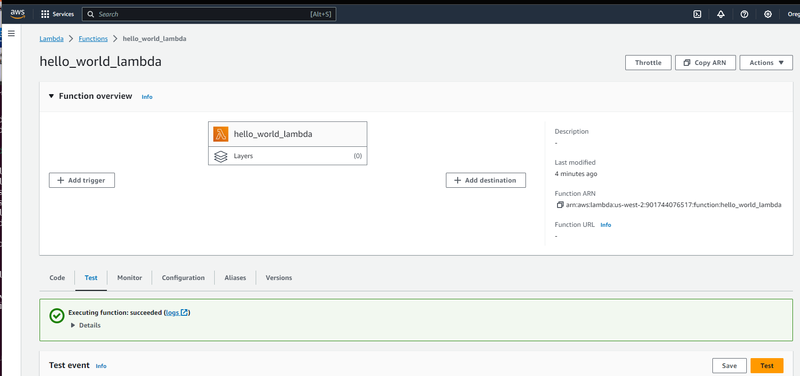

# Terraform Hello World Lambda

This was a quick demo project to learn a bit about how terraform works and basic
Terraform HCL by configuring a basic python lambda that runs in AWS.

It was written by viewing Terraform's [AWS
tutorial](https://developer.hashicorp.com/terraform/tutorials/aws-get-started/aws-build)
and then reading the [AWS Terraform provider
documentation](https://registry.terraform.io/providers/hashicorp/aws/latest/docs(

# Prerequisites

- Terraform 1.6.3 or newer. [Installation tutorial](https://developer.hashicorp.com/terraform/tutorials/aws-get-started/install-cli)
- An AWS account to deploy to

# Setup

Terraform must fetch the aws provider used by this Terraform configuration - use `terraform init`

AWS credentials must be set up. I did this by setting environment variables
needed. AWS documentation on how to obtain these:
https://docs.aws.amazon.com/IAM/latest/UserGuide/id_credentials_access-keys.html

Once obtained, set up your environment variables as:

```
export AWS_ACCESS_KEY_ID=access key here
export AWS_SECRET_ACCESS_KEY=secret access key here
export AWS_DEFAULT_REGION=us-west-2
```

TODO: I don't know a good IAM policy appropriate for terraform deployment, so I
generated a root key temporarily for deployment, then deleted it after. This is
not a good idea to use for a production environment.


# Build

This is a dry-run for a deployment of your Terraform configuration. It will have
terraform plan which AWS api calls it will make to create or update your
infrastructure, but not actually do the deployment, and lets you see ahead of
time which resources would be affected, and if there is an error in your
configuration:

```
terraform plan
```


# Deployment


Use `terraform apply`. Depending on your change, expect to see something like:


```
❯ terraform apply
data.archive_file.hello_world_lambda_zipfile: Reading...
data.archive_file.hello_world_lambda_zipfile: Read complete after 0s [id=4ac02fe1e285b065e821ecd5e516ff3b7904511d]
data.aws_iam_policy_document.assume_role: Reading...
data.aws_iam_policy_document.assume_role: Read complete after 0s [id=2690255455]
aws_iam_role.lambda_service_role: Refreshing state... [id=lambda_service_role]
aws_lambda_function.hello_world_lambda: Refreshing state... [id=hello_world_lambda]

Terraform used the selected providers to generate the following execution plan. Resource actions are indicated with the following symbols:
  ~ update in-place

Terraform will perform the following actions:

  # aws_lambda_function.hello_world_lambda will be updated in-place
  ~ resource "aws_lambda_function" "hello_world_lambda" {
        id                             = "hello_world_lambda"
      ~ last_modified                  = "2023-11-11T22:22:18.000+0000" -> (known after apply)
      ~ source_code_hash               = "uLWIeSA8sMukLAOqKGtT/EA6QvzEILU3jeH86yFt9I0=" -> "k/wnbsLeCtxcxCgDUIKAEU0o/H/9rwDcpYU5dp6rIjU="
        tags                           = {}
        # (20 unchanged attributes hidden)

        # (2 unchanged blocks hidden)
    }

Plan: 0 to add, 1 to change, 0 to destroy.

Do you want to perform these actions?
  Terraform will perform the actions described above.
  Only 'yes' will be accepted to approve.

  Enter a value: yes

aws_lambda_function.hello_world_lambda: Modifying... [id=hello_world_lambda]
aws_lambda_function.hello_world_lambda: Modifications complete after 5s [id=hello_world_lambda]

Apply complete! Resources: 0 added, 1 changed, 0 destroyed.
```

# Running

Log in to the AWs console, and navigate to your Lamda. Give it a try!


